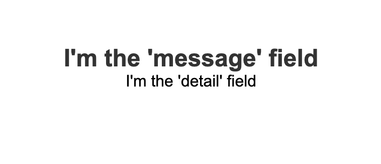

# static
Somewhere to link redirects to that provides a simple message determined by the query parameters included in the following URL.

https://mungrel.github.io/static

### Configurable values

The following query parameters can be used to configure the corresponding fields.

| Parameter | Purpose                                                                      |
|-----------|------------------------------------------------------------------------------|
| `title`     | Sets the title of the window (note a hint will be displayed if not provided) |
| `message`   | The primary message displayed on the page                                    |
| `detail`    | Secondary message providing extra detail                                     |

### Example

#### Title

#### Page

[Example site](https://mungrel.github.io/static/?title=I%27m%20the%20title&message=I%27m%20the%20%27message%27%20field&detail=I%27m%20the%20%27detail%27%20field)
